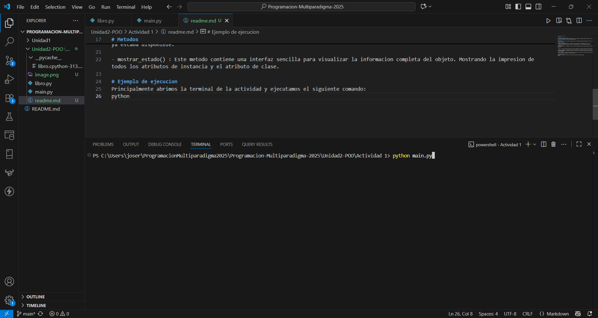
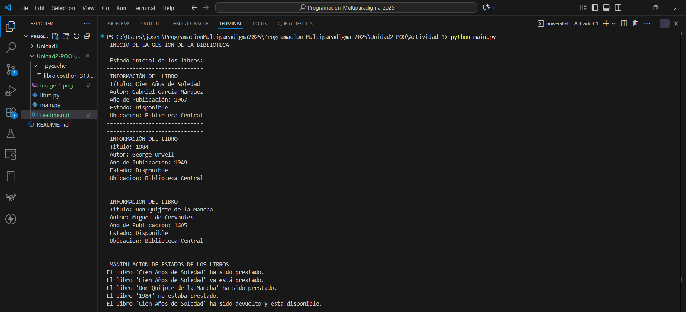
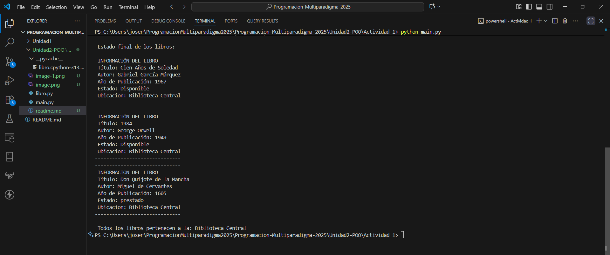

# Jose Roberto Carrizales
# 21100177

# Gestion simple de una biblioteca
Esta actividad demuestra los conceptos fundamentales de la Programación Orientada a Objetos en Python a través de una clase simple, llamada Libro, que modela un elemento dentro de un sistema de biblioteca.

# Clase Libro
El diseño de la clase Libro se enfoca en encapsular toda la información necesaria para gestionar un libro y su estado de disponibilidad de manera clara y eficiente.

Atributos de Instancia:
- Titulo, autor y año_publicacion: Son esenciales ya que forman parte de la identidad unica del libro.
- Prestado: Un booleano inicializado en "False", este cambiaa segun las acciones de prestamo o devolucion.

Atributo de Clase:
- Biblioteca: Este por ser compartido por todos los libros instanciados ya que asi evitamos duplicar la misma cadena de texto en la memoria por cada libro.

# Metodos
- __init__ : Tiene el proposito de inicializar de forma obligatoria los atributos identificadores al momento de crear un objeto Libro.

- prestar() y devolver() : Estos metodos son cruciales para modificar el estado del libro, actuando como puntos de control. Incluyendo cada uno su logica correspondiente de validacion para notificar al usuario, en caso de que se quiera prestar un libro que ya esta prestado o devolver uno que ya estaba disponible.

- mostrar_estado() : Este metodo contiene una interfaz sencilla para visualizar la informacion completa del objeto. Mostrando la impresion de todos los atributos de instancia y el atributo de clase.

# Ejecucion
Principalmente abrimos la terminal de la actividad y ejecutamos el siguiente comando:
python main.py

Ahora nos mostrara la informacion de cada libro y la manipulacion que se le realizo a cada uno.

Despues de cada manipulacion que se le realizo a cada libro, nos mostrara el estado final de cada uno.
