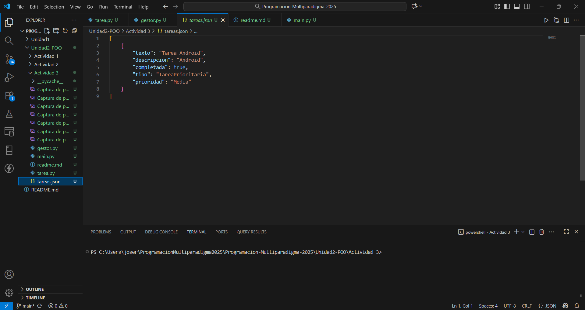

# Sistema de Gestion de Tareas en Python

## Descripcion del Proyecto

Este es un sistema de gestion de tareas desarrollado en Python como una aplicacion de consola. El objetivo principal es aplicar los principios fundamentales de la Programacion Orientada a Objetos (POO) para crear un programa funcional, organizado y facil de mantener.

El sistema permite a los usuarios:
- Agregar tareas, diferenciando entre tareas normales y prioritarias.
- Listar todas las tareas pendientes y completadas.
- Marcar tareas como completadas.
- Eliminar tareas de la lista.
- Guardar el estado de las tareas en un archivo "tareas.json" para que los datos persistan entre ejecuciones.

## Instrucciones de Ejecucion

1.  **Requisitos:** Tener Python 3 instalado en tu sistema.
2.  **Clonar/Descargar:** Asegurate de tener todos los archivos ("tarea.py", "gestor.py", "main.py") en la misma carpeta.
3.  **Abrir la consola:** Navega hasta el directorio donde guardaste los archivos.
4.  **Ejecutar el programa:** Lanza el script principal con el siguiente comando:
    python main.py

5.  **Interactuar:** Sigue las instrucciones que aparecen en el menu de la consola.

## Explicacion del Diseño (POO)

El proyecto esta estructurado siguiendo los pilares de la Programacion Orientada a Objetos:

### 1. Clases y Objetos
-   **"Tarea"**: Es la clase base que modela una tarea generica. Un objeto de esta clase representa una tarea individual con atributos como "texto", "descripcion" y "completada".
-   **"TareaPrioritaria"**: Es una clase especializada que hereda de "Tarea". Un objeto de esta clase representa una tarea que, ademas de los atributos basicos, tiene un nivel de "prioridad".
-   **"GestorTareas"**: Actua como la clase controladora. Un objeto de esta clase se encarga de orquestar todas las operaciones sobre la lista de tareas (agregar, eliminar, listar, guardar y cargar).

### 2. Encapsulacion
La encapsulacion se implementa para proteger los datos internos de los objetos y exponer solo una interfaz controlada.
-   Los atributos de la clase "Tarea" se definen como "protegidos" usando un guion bajo.
-   Se utilizan **propiedades ("@property")** como metodos "getter" para permitir un acceso de solo lectura a estos atributos desde fuera de la clase, evitando su modificacion directa e inesperada.

### 3. Herencia
La herencia se utiliza para crear una jerarquia de clases y reutilizar codigo.
-   La clase "TareaPrioritaria" **hereda** de la clase "Tarea".
-   Esto significa que "TareaPrioritaria" automaticamente adquiere todos los atributos y metodos de "Tarea", y solo necesita definir lo que es especifico para ella (el atributo "prioridad" y la logica para mostrarlo).

### 4. Polimorfismo
El polimorfismo permite que objetos de diferentes clases respondan al mismo mensaje (llamada de metodo) de maneras distintas.
-   Tanto "Tarea" como "TareaPrioritaria" tienen un metodo llamado "mostrar_info()".
-   En la clase "TareaPrioritaria", este metodo esta **redefinido (overridden)** para incluir la informacion de la prioridad.
-   Cuando en el "GestorTareas" se recorre la lista de tareas y se llama a "tarea.mostrar_info()", Python automaticamente ejecuta la version correcta del metodo segun si el objeto es una "Tarea" o una "TareaPrioritaria", sin necesidad de comprobaciones adicionales.

### 5. Persistencia de Datos
Para que las tareas no se pierdan al cerrar el programa, se implemento un mecanismo de guardado y carga usando el formato **JSON**.
-   El "GestorTareas" contiene los metodos "guardar_tareas()" y "cargar_tareas()".
-   Al guardar, se convierte la lista de objetos de tarea en un formato de diccionario que puede ser escrito en un archivo JSON. Se almacena el "tipo" de cada tarea para poder reconstruirla correctamente.
-   Al cargar, se lee el archivo JSON y se recrean los objetos "Tarea" o "TareaPrioritaria" correspondientes, restaurando el estado del programa.

# Ejecucion del programa

Principalmente ejecutamos el siguiente comando en la consola de la actividad:

Despues nos aparecera el menu con las diferentes opciones a elegir:

En caso de elegir la opcion 1 nos dejara agregar una tarea, completando los siguientes campos, para al final que vuelva a aparecer el mismo menu para elegir otra opcion

Ahora elegimos la opcion 2 para ver el listado de todas las tareas agregadas:

Ahora elegimos la opcion 3 para marcar alguna tarea como completada introduciendo el numero de tarea:

Ahora elegimos la opcion 4 para eliminar alguna tarea que ya hayamos completado o simplemente ya no sea de nuestro agrado, de igual manera introduciendo el numero de tarea:

Para finalizar, la opcion 5, que tiene la funcion de salir del sistema:

Y en el archivo .json tendremos el listado de tareas agregadas que no se han eliminado:
 