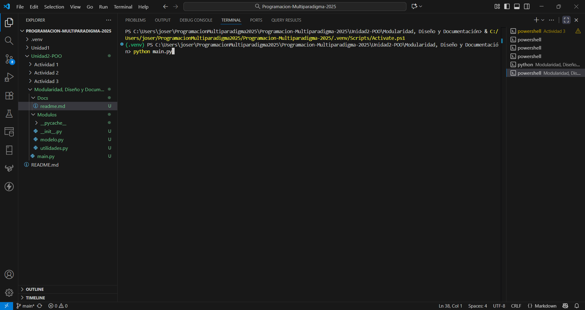
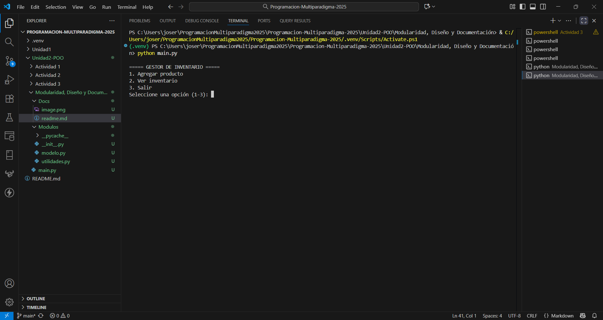
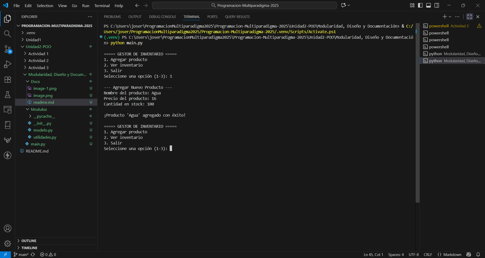
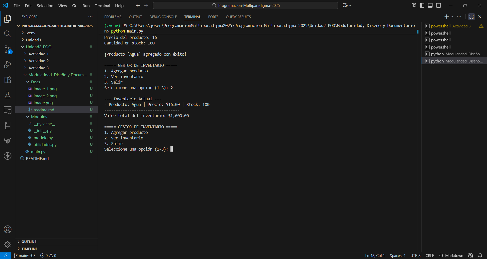
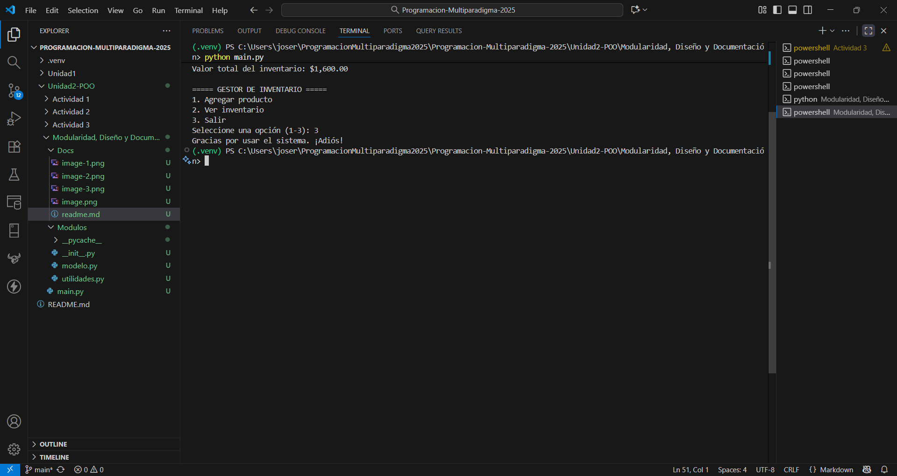

# Proyecto: Gestor de Inventario Básico

Este proyecto es un sistema simple de línea de comandos para gestionar un inventario de productos.

## Propósito del Programa

El programa permite al usuario realizar operaciones básicas de inventario, como agregar nuevos productos y ver el estado actual del inventario, incluyendo el valor total de todos los productos en stock.

## Cómo Ejecutar el Proyecto

1.  Asegúrate de tener Python 3 instalado.
2.  Clona este repositorio o descarga los archivos.
3.  Navega hasta la carpeta raíz del proyecto (proyecto_inventario/).
4.  Ejecuta el programa desde la terminal con el siguiente comando:

    python main.py

5.  Sigue las instrucciones del menú en pantalla.

## Descripción de Módulos

El proyecto está organizado en un paquete (modulos) y un script principal (main.py) para una clara separación de responsabilidades.

* main.py:
    * **Propósito:** Es el punto de entrada principal. Contiene la lógica de la interfaz de usuario (el menú) y coordina el flujo del programa.
    * **Funciones clave:** main_menu(), agregar_producto(), ver_inventario().

* modulos/modelo.py:
    * **Propósito:** Define las estructuras de datos y la lógica de negocio. Contiene la clase "Producto" que representa un ítem del inventario.
    * **Clases clave:** Producto (con métodos como `__init__`, `__str__`, `calcular_valor_total`).

* modulos/utilidades.py:
    * **Propósito:** Contiene funciones auxiliares reutilizables, principalmente para la validación de datos ingresados por el usuario.
    * **Funciones clave:** validar_entero_positivo().

# Ejecución del programa
- Ejecutamos el comando python main.py para iniciar el programa.

- Aparecera una lista de opciones a elegir, donde seleccionamos la opción 1 para agregar un producto.

- Nos aparecera para llenar la información del producto que queremos agregar al inventario, y una vez finalizado nos volvera a mostrar el menu automaticamente.

- Ahora seleccionamos la opción 2 para ver todo nuestro inventario, donde por el momento solo nos aparecera el producto "Agua" que recien agregamos.

- Y por ultimo seleccionamos la opción 3 para salir del programa.
