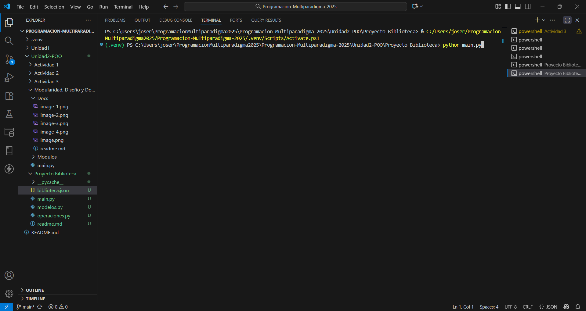

# Proyecto: Sistema de Gestión de Biblioteca (POO)

Este proyecto es una aplicación de consola simple para gestionar un catálogo de libros y préstamos a usuarios, desarrollada en Python y aplicando los principios de la Programación Orientada a Objetos.

## Características

* **Gestión de Libros:** Agregar nuevos libros al catálogo.
* **Gestión de Usuarios:** Registrar nuevos usuarios.
* **Sistema de Préstamos:** Prestar y devolver libros, actualizando automáticamente el estado del libro y el inventario del usuario.
* **Persistencia de Datos:** Toda la información se guarda automáticamente en un archivo "biblioteca.json" y se carga al iniciar la aplicación.
* **Consulta de Información:** Permite ver todos los libros disponibles y consultar los detalles de un usuario.

## Estructura del Código

El proyecto está organizado en tres módulos principales para asegurar la modularidad:

* modelos.py: Contiene las clases de entidad que representan los "datos" del sistema:
    * Persona: Clase base.
    * Usuario: Hereda de "Persona". Almacena nombre y lista de libros prestados.
    * Libro: Almacena título, autor, año y estado, ya sea disponible o prestado.

* operaciones.py: Contiene la clase de "gestión" que maneja la lógica:
    * Biblioteca: Se encarga de agregar/buscar libros y usuarios, procesar préstamos/devoluciones y gestionar la persistencia de datos.

* main.py: Es el punto de entrada de la aplicación.
    * Contiene la interfaz de usuario y el bucle principal que recibe las entradas del usuario y llama a los métodos correspondientes de la clase "Biblioteca".

## Instrucciones para Ejecutar

1. Coloca los archivos "main.py", "modelos.py" y "operaciones.py" en el mismo directorio.
2. Abre una terminal o línea de comandos en ese directorio.
3. Ejecuta el programa con el siguiente comando:

    python main.py
    

4. Sigue las instrucciones del menú en pantalla.

- Seleccionamos la opción 1 para agregar un nuevo libro y llenamos los campos solicitados.

- Seleccionamos la opción 2 para registrar un nuevo usuario y llenamos los campos solicitados.

- Seleccionamos la opción 3 para mostrar los libros disponibles y llenamos los campos solicitados.

- Seleccionamos la opción 4 para prestar un libro y llenamos los campos solicitados.

- Seleccionamos la opción 5 para devolver un libro y llenamos los campos solicitados.

- Seleccionamos la opción 6 para mostrar los detalles de usuario y llenamos los campos solicitados.

- Seleccionamos la opción 7 para salir del programa.

5. El archivo "biblioteca.json" se creará y actualizará en el mismo directorio.

